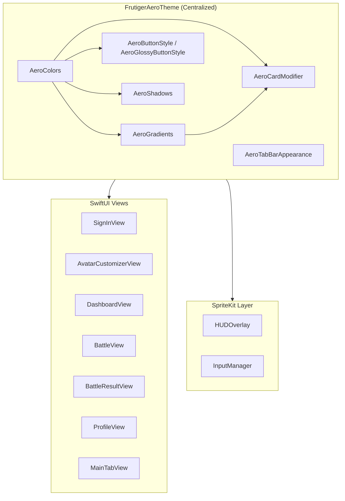
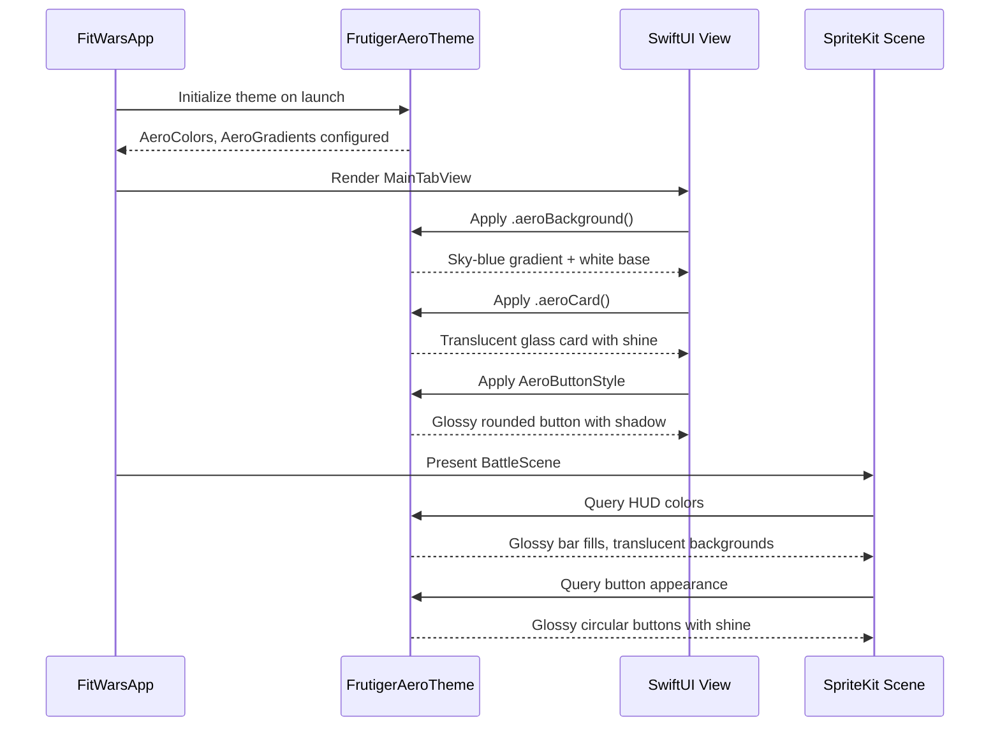
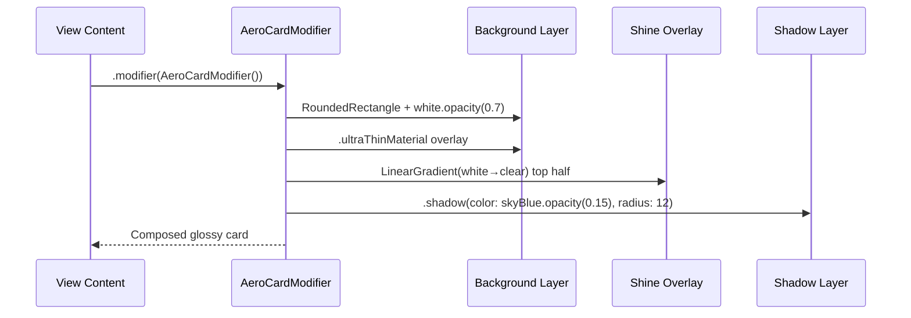

# Design Document: Frutiger Aero Theme

## Overview

PulseCombat currently uses a dark, flat UI with orange accents and `.ultraThinMaterial` backgrounds. This feature replaces the entire visual identity with a Frutiger Aero aesthetic — the glossy, translucent, bubbly design language of the late 2000s exemplified by the Nintendo Wii menu, Windows Vista/7 Aero glass, and early iPhone skeuomorphism.

The theme system is centralized in a single `FrutigerAeroTheme` module that provides colors, gradients, button styles, card styles, and view modifiers. All seven SwiftUI screens (SignInView, AvatarCustomizerView, DashboardView, BattleView, BattleResultView, ProfileView, MainTabView) adopt the light/glossy aesthetic. The SpriteKit battle scene retains its dark background (fighting games need contrast) but the HUD and input controls receive a complementary glossy treatment.

Key visual pillars: light/white backgrounds with sky-blue gradients, glossy rounded buttons with shine overlays, translucent glass-effect cards (Wii channel tiles), soft drop shadows and glow effects, and a vibrant but soft accent palette (aqua, sky blue, green) replacing the current harsh orange.

## Architecture



## Sequence Diagrams

### Theme Application Flow



### Card Rendering Detail



## Components and Interfaces

### Component 1: AeroColors

**Purpose**: Centralized color palette replacing the current orange-centric scheme.

```swift
enum AeroColors {
    // Primary palette
    static let skyBlue = Color(red: 0.53, green: 0.81, blue: 0.98)
    static let aqua = Color(red: 0.0, green: 0.80, blue: 0.82)
    static let softGreen = Color(red: 0.56, green: 0.89, blue: 0.56)
    static let white = Color.white
    static let pearl = Color(red: 0.97, green: 0.97, blue: 0.99)

    // Accent colors (replacing orange)
    static let primaryAccent = skyBlue
    static let secondaryAccent = aqua
    static let successGreen = softGreen
    static let warningAmber = Color(red: 1.0, green: 0.78, blue: 0.24)

    // Glass/translucency
    static let glassWhite = Color.white.opacity(0.7)
    static let glassBorder = Color.white.opacity(0.5)
    static let shineTint = Color.white.opacity(0.4)

    // Text
    static let primaryText = Color(red: 0.2, green: 0.2, blue: 0.3)
    static let secondaryText = Color(red: 0.45, green: 0.47, blue: 0.55)

    // Stat colors (kept for game identity)
    static let strengthRed = Color(red: 0.95, green: 0.35, blue: 0.35)
    static let staminaGreen = Color(red: 0.30, green: 0.78, blue: 0.40)
    static let speedBlue = Color(red: 0.30, green: 0.55, blue: 0.95)
}
```

**Responsibilities**:
- Single source of truth for all colors in the app
- Replaces all hardcoded `.orange`, `.gray`, `.secondary` references
- Provides semantic naming for consistent usage

### Component 2: AeroGradients

**Purpose**: Reusable gradient definitions for backgrounds, buttons, and overlays.

```swift
enum AeroGradients {
    /// Main screen background: white at bottom fading to sky blue at top
    static let background = LinearGradient(
        colors: [AeroColors.pearl, AeroColors.skyBlue.opacity(0.3)],
        startPoint: .bottom,
        endPoint: .top
    )

    /// Button fill: glossy aqua-to-blue
    static let buttonPrimary = LinearGradient(
        colors: [AeroColors.skyBlue, AeroColors.aqua],
        startPoint: .top,
        endPoint: .bottom
    )

    /// Shine overlay for glossy effect (top half of any element)
    static let shine = LinearGradient(
        colors: [Color.white.opacity(0.5), Color.white.opacity(0.0)],
        startPoint: .top,
        endPoint: .center
    )

    /// Card background: subtle white-to-pearl
    static let card = LinearGradient(
        colors: [Color.white.opacity(0.85), Color.white.opacity(0.6)],
        startPoint: .topLeading,
        endPoint: .bottomTrailing
    )

    /// Tab bar background
    static let tabBar = LinearGradient(
        colors: [Color.white.opacity(0.95), AeroColors.skyBlue.opacity(0.1)],
        startPoint: .top,
        endPoint: .bottom
    )
}
```

**Responsibilities**:
- Encapsulates all gradient logic
- Ensures consistent glossy feel across components
- Provides the signature Frutiger Aero "shine" overlay

### Component 3: AeroButtonStyle

**Purpose**: SwiftUI `ButtonStyle` that renders glossy, rounded, bubbly buttons with shine overlay and soft shadow.

```swift
struct AeroButtonStyle: ButtonStyle {
    var gradient: LinearGradient = AeroGradients.buttonPrimary
    var cornerRadius: CGFloat = 18
    var shadowColor: Color = AeroColors.skyBlue.opacity(0.3)
    var shadowRadius: CGFloat = 8

    func makeBody(configuration: Configuration) -> some View {
        configuration.label
            .font(.headline)
            .foregroundStyle(.white)
            .padding(.horizontal, 24)
            .padding(.vertical, 14)
            .background(
                ZStack {
                    RoundedRectangle(cornerRadius: cornerRadius)
                        .fill(gradient)
                    // Shine overlay — top half
                    RoundedRectangle(cornerRadius: cornerRadius)
                        .fill(AeroGradients.shine)
                        .frame(height: 28)
                        .frame(maxHeight: .infinity, alignment: .top)
                        .clipShape(RoundedRectangle(cornerRadius: cornerRadius))
                }
            )
            .clipShape(RoundedRectangle(cornerRadius: cornerRadius))
            .shadow(color: shadowColor, radius: shadowRadius, y: 4)
            .scaleEffect(configuration.isPressed ? 0.96 : 1.0)
            .animation(.easeInOut(duration: 0.1), value: configuration.isPressed)
    }
}
```

**Responsibilities**:
- Primary interactive button style for all CTAs
- Provides glossy shine overlay on top half
- Soft press animation (scale down)
- Configurable gradient, corner radius, shadow

### Component 4: AeroCardModifier

**Purpose**: ViewModifier that wraps content in a Wii-channel-tile-style translucent glass card.

```swift
struct AeroCardModifier: ViewModifier {
    var cornerRadius: CGFloat = 20
    var padding: CGFloat = 16

    func body(content: Content) -> some View {
        content
            .padding(padding)
            .background(
                ZStack {
                    // Glass base
                    RoundedRectangle(cornerRadius: cornerRadius)
                        .fill(AeroColors.glassWhite)
                        .background(
                            RoundedRectangle(cornerRadius: cornerRadius)
                                .fill(.ultraThinMaterial)
                        )
                    // Shine overlay
                    RoundedRectangle(cornerRadius: cornerRadius)
                        .fill(AeroGradients.shine)
                        .frame(maxHeight: .infinity, alignment: .top)
                        .clipShape(RoundedRectangle(cornerRadius: cornerRadius))
                    // Border
                    RoundedRectangle(cornerRadius: cornerRadius)
                        .stroke(AeroColors.glassBorder, lineWidth: 1)
                }
            )
            .shadow(color: AeroColors.skyBlue.opacity(0.12), radius: 12, y: 4)
    }
}

extension View {
    func aeroCard(cornerRadius: CGFloat = 20) -> some View {
        modifier(AeroCardModifier(cornerRadius: cornerRadius))
    }
}
```

**Responsibilities**:
- Reusable glass-card effect for all content containers
- Combines translucent material + white overlay + shine + border
- Replaces all `.background(.ultraThinMaterial, in: RoundedRectangle(...))` patterns

### Component 5: AeroBackgroundModifier

**Purpose**: Full-screen background gradient applied to all screens.

```swift
struct AeroBackgroundModifier: ViewModifier {
    func body(content: Content) -> some View {
        content
            .background(
                AeroGradients.background
                    .ignoresSafeArea()
            )
    }
}

extension View {
    func aeroBackground() -> some View {
        modifier(AeroBackgroundModifier())
    }
}
```

### Component 6: AeroTabBarAppearance

**Purpose**: Configures UITabBarAppearance for a glossy, floating Wii-like tab bar.

```swift
enum AeroTabBarAppearance {
    static func configure() {
        let appearance = UITabBarAppearance()
        appearance.configureWithOpaqueBackground()
        appearance.backgroundColor = UIColor.white.withAlphaComponent(0.92)
        appearance.shadowColor = UIColor(AeroColors.skyBlue).withAlphaComponent(0.15)

        // Selected item: aqua tint
        let selectedColor = UIColor(AeroColors.aqua)
        appearance.stackedLayoutAppearance.selected.iconColor = selectedColor
        appearance.stackedLayoutAppearance.selected.titleTextAttributes = [
            .foregroundColor: selectedColor
        ]

        // Unselected item: soft gray
        let normalColor = UIColor(AeroColors.secondaryText)
        appearance.stackedLayoutAppearance.normal.iconColor = normalColor
        appearance.stackedLayoutAppearance.normal.titleTextAttributes = [
            .foregroundColor: normalColor
        ]

        UITabBar.appearance().standardAppearance = appearance
        UITabBar.appearance().scrollEdgeAppearance = appearance
    }
}
```


## Data Models

### ThemeConfiguration

```swift
/// Optional runtime theme configuration for future extensibility
/// (e.g., user-selectable accent colors, dark mode toggle)
struct ThemeConfiguration {
    var accentColor: Color = AeroColors.primaryAccent
    var backgroundGradient: LinearGradient = AeroGradients.background
    var cardCornerRadius: CGFloat = 20
    var buttonCornerRadius: CGFloat = 18
    var enableShineEffects: Bool = true
    var enableGlowEffects: Bool = true
}
```

**Validation Rules**:
- `cardCornerRadius` must be in range 8...32
- `buttonCornerRadius` must be in range 8...24
- `accentColor` must have sufficient contrast against white backgrounds (WCAG AA)

### SpriteKit Color Mapping

```swift
/// Maps AeroColors to SKColor for SpriteKit HUD elements
enum AeroSKColors {
    static let hudGlassBackground = SKColor.white.withAlphaComponent(0.15)
    static let hudGlassBorder = SKColor.white.withAlphaComponent(0.4)
    static let hudShine = SKColor.white.withAlphaComponent(0.3)
    static let healthBarBackground = SKColor.white.withAlphaComponent(0.12)
    static let meterBackground = SKColor.white.withAlphaComponent(0.1)
    static let buttonGlow = SKColor(red: 0.53, green: 0.81, blue: 0.98, alpha: 0.4)
    static let labelColor = SKColor.white
    static let secondaryLabel = SKColor(white: 0.85, alpha: 0.9)
}
```

## Algorithmic Pseudocode

### Glossy Button Rendering Algorithm

```swift
// ALGORITHM: Render a Frutiger Aero glossy button
// INPUT: label content, gradient, cornerRadius, isPressed state
// OUTPUT: Composed view with glass effect
//
// Preconditions:
//   - cornerRadius > 0
//   - gradient has at least 2 color stops
//
// Postconditions:
//   - Button has rounded rectangle base with gradient fill
//   - Top half has white-to-transparent shine overlay
//   - Soft colored shadow beneath
//   - Scale reduces to 0.96 when pressed
//
// Steps:
//   1. Render label with white foreground
//   2. Apply horizontal + vertical padding
//   3. Layer background:
//      a. Base: RoundedRectangle filled with gradient
//      b. Shine: RoundedRectangle filled with top-to-center white gradient,
//         clipped to top half, clipped to same corner radius
//   4. Clip entire stack to RoundedRectangle
//   5. Apply shadow(color: accent.opacity(0.3), radius: 8, y: 4)
//   6. Apply scaleEffect(isPressed ? 0.96 : 1.0) with easeInOut animation
```

### Glass Card Compositing Algorithm

```swift
// ALGORITHM: Compose a Wii-channel-tile glass card
// INPUT: child content, cornerRadius, padding
// OUTPUT: Glass-effect card wrapping content
//
// Preconditions:
//   - cornerRadius in range 8...32
//   - content is a valid SwiftUI View
//
// Postconditions:
//   - Content is padded and wrapped in translucent card
//   - Card has 4 visual layers: glass base, material, shine, border
//   - Soft sky-blue shadow beneath
//
// Layer stack (bottom to top):
//   1. RoundedRectangle filled with .ultraThinMaterial
//   2. RoundedRectangle filled with white.opacity(0.7)
//   3. RoundedRectangle filled with shine gradient (white.0.5 → clear)
//      clipped to card shape
//   4. RoundedRectangle stroked with white.opacity(0.5), lineWidth 1
//   5. Shadow: skyBlue.opacity(0.12), radius 12, y-offset 4
```

### SpriteKit HUD Glossy Health Bar Algorithm

```swift
// ALGORITHM: Render glossy health bar in SpriteKit
// INPUT: barWidth, barHeight, healthPercentage (0.0–1.0)
// OUTPUT: SKNode tree with glass-effect health bar
//
// Preconditions:
//   - barWidth > 0, barHeight > 0
//   - healthPercentage in 0.0...1.0
//
// Postconditions:
//   - Bar has translucent white background (glass effect)
//   - Fill color interpolates green→yellow→red based on percentage
//   - White shine line across top 30% of bar
//   - Soft white border with rounded corners
//
// Steps:
//   1. Create background SKShapeNode:
//      - fillColor = white.withAlphaComponent(0.12)
//      - cornerRadius = barHeight / 3
//   2. Create fill SKShapeNode:
//      - width = barWidth * healthPercentage
//      - fillColor = colorForPercentage(healthPercentage)
//      - cornerRadius = barHeight / 3
//   3. Create shine SKShapeNode:
//      - rect covering top 30% of bar
//      - fillColor = white.withAlphaComponent(0.25)
//   4. Create border SKShapeNode:
//      - strokeColor = white.withAlphaComponent(0.3)
//      - lineWidth = 1
//   5. Stack: background → fill → shine → border
```

### Tab Bar Appearance Configuration Algorithm

```swift
// ALGORITHM: Configure Wii-style floating tab bar
// INPUT: none (uses AeroColors constants)
// OUTPUT: UITabBarAppearance applied globally
//
// Preconditions:
//   - Called once during app initialization (init() of FitWarsApp)
//
// Postconditions:
//   - Tab bar has white/translucent background
//   - Selected items use aqua tint
//   - Unselected items use soft gray
//   - Subtle sky-blue shadow on top edge
//
// Steps:
//   1. Create UITabBarAppearance with opaque background
//   2. Set backgroundColor = white.withAlphaComponent(0.92)
//   3. Set shadowColor = skyBlue.withAlphaComponent(0.15)
//   4. Configure selected state: iconColor = aqua, titleColor = aqua
//   5. Configure normal state: iconColor = secondaryText, titleColor = secondaryText
//   6. Apply to UITabBar.appearance().standardAppearance
//   7. Apply to UITabBar.appearance().scrollEdgeAppearance
```

## Key Functions with Formal Specifications

### Function 1: AeroButtonStyle.makeBody()

```swift
func makeBody(configuration: Configuration) -> some View
```

**Preconditions:**
- `configuration.label` is a valid SwiftUI view
- `gradient` has been initialized with valid color stops
- `cornerRadius` > 0

**Postconditions:**
- Returns a view with glossy rounded rectangle background
- Shine overlay covers top portion of button
- Shadow is applied beneath the button
- Scale is 0.96 when `configuration.isPressed` is true, 1.0 otherwise
- Animation is applied to scale transition

**Loop Invariants:** N/A

### Function 2: AeroCardModifier.body()

```swift
func body(content: Content) -> some View
```

**Preconditions:**
- `content` is a valid SwiftUI view
- `cornerRadius` in range 8...32
- `padding` >= 0

**Postconditions:**
- Content is wrapped with padding
- Background has 4 layers: material, glass white, shine, border
- Shadow applied with sky-blue tint
- All layers share the same corner radius

**Loop Invariants:** N/A

### Function 3: AeroTabBarAppearance.configure()

```swift
static func configure()
```

**Preconditions:**
- Called from main thread (UIKit appearance APIs)
- Called before any UITabBar is rendered

**Postconditions:**
- `UITabBar.appearance().standardAppearance` is set
- `UITabBar.appearance().scrollEdgeAppearance` is set
- Selected tab items render in aqua color
- Unselected tab items render in secondary text color
- Tab bar background is white with 0.92 opacity

**Loop Invariants:** N/A

### Function 4: HUDOverlay Glossy Health Bar

```swift
func setup(sceneSize: CGSize)  // Updated to use glossy styling
```

**Preconditions:**
- `sceneSize.width` > 0 and `sceneSize.height` > 0
- Node is added to a valid SKScene

**Postconditions:**
- Health bars use translucent white backgrounds instead of dark
- Shine overlay node added to each health bar
- Border uses white.opacity(0.3) instead of gray
- Special meter bars follow same glossy treatment
- All label colors remain white (readable against dark battle background)

**Loop Invariants:** N/A

## Example Usage

### Applying Theme to a View

```swift
// Before (current dark/orange style):
VStack {
    Text("Dashboard")
    statsGrid
}
.background(.ultraThinMaterial, in: RoundedRectangle(cornerRadius: 16))

// After (Frutiger Aero):
VStack {
    Text("Dashboard")
        .foregroundStyle(AeroColors.primaryText)
    statsGrid
}
.aeroCard()
```

### Glossy Button

```swift
// Before:
Button("FIGHT") { ... }
    .background(.orange)
    .foregroundStyle(.white)
    .clipShape(RoundedRectangle(cornerRadius: 14))

// After:
Button("FIGHT") { ... }
    .buttonStyle(AeroButtonStyle())
```

### Screen Background

```swift
// Before:
NavigationStack {
    ScrollView { content }
}

// After:
NavigationStack {
    ScrollView { content }
        .aeroBackground()
}
```

### Tab Bar Setup

```swift
// In FitWarsApp.init():
init() {
    FirebaseApp.configure()
    AeroTabBarAppearance.configure()
}

// In MainTabView:
TabView { ... }
    .tint(AeroColors.aqua)  // replaces .tint(.orange)
```

### SpriteKit HUD Button (InputManager)

```swift
// Before:
btn.fillColor = color.withAlphaComponent(0.6)
btn.strokeColor = color
btn.lineWidth = 2

// After:
btn.fillColor = SKColor.white.withAlphaComponent(0.2)
btn.strokeColor = SKColor.white.withAlphaComponent(0.5)
btn.lineWidth = 1.5
// Add shine node
let shine = SKShapeNode(circleOfRadius: radius * 0.7)
shine.fillColor = SKColor.white.withAlphaComponent(0.15)
shine.strokeColor = .clear
shine.position = CGPoint(x: 0, y: radius * 0.2)
btn.addChild(shine)
// Add glow
btn.glowWidth = 2
```

## Correctness Properties

1. **Color Consistency**: ∀ view V in SwiftUI layer, V uses only colors from `AeroColors` — no hardcoded `.orange`, `.gray`, or raw Color literals remain in themed views.

2. **Card Glass Effect**: ∀ card C rendered with `aeroCard()`, C has exactly 4 background layers (material, glass white, shine, border) and 1 shadow.

3. **Button Shine Overlay**: ∀ button B styled with `AeroButtonStyle`, B contains a shine gradient overlay that covers the top portion and is clipped to the button's corner radius.

4. **Press Feedback**: ∀ button B styled with `AeroButtonStyle`, when `isPressed == true`, B.scaleEffect == 0.96; when `isPressed == false`, B.scaleEffect == 1.0.

5. **Tab Bar Tint**: MainTabView.tint uses `AeroColors.aqua` (not `.orange`). Selected tab items render in aqua. Unselected items render in `AeroColors.secondaryText`.

6. **Background Gradient**: ∀ screen S in {SignIn, AvatarCustomizer, Dashboard, Battle, BattleResult, Profile}, S has `aeroBackground()` applied, producing a pearl-to-skyBlue gradient.

7. **SpriteKit Dark Preservation**: BattleScene background color remains dark. Only HUD overlay elements and input controls receive glossy treatment.

8. **HUD Readability**: ∀ label L in HUDOverlay, L.fontColor is white or near-white, ensuring readability against the dark battle background.

9. **Corner Radius Consistency**: ∀ card C, C.cornerRadius == 20. ∀ button B, B.cornerRadius == 18. No sharp corners in themed UI.

10. **Shadow Consistency**: ∀ card C with `aeroCard()`, C.shadow.color == skyBlue.opacity(0.12), C.shadow.radius == 12, C.shadow.y == 4.

## Error Handling

### Error Scenario 1: Missing Theme Application

**Condition**: A view is added or modified without applying Frutiger Aero modifiers
**Response**: Visual inconsistency — dark/orange elements appear alongside glossy elements
**Recovery**: Code review checklist ensures all new views use `aeroBackground()`, `aeroCard()`, and `AeroButtonStyle`. SwiftUI previews catch visual regressions.

### Error Scenario 2: SpriteKit Color Mismatch

**Condition**: SpriteKit nodes reference UIColor/SKColor values not from `AeroSKColors`
**Response**: HUD elements look inconsistent with SwiftUI layer
**Recovery**: All SpriteKit color references centralized in `AeroSKColors` enum. HUD setup method uses only these constants.

### Error Scenario 3: Tab Bar Appearance Not Applied

**Condition**: `AeroTabBarAppearance.configure()` not called before first render
**Response**: Tab bar renders with system default appearance
**Recovery**: Call is placed in `FitWarsApp.init()` before any view renders, alongside `FirebaseApp.configure()`.

### Error Scenario 4: Performance Degradation from Overlays

**Condition**: Too many `.ultraThinMaterial` + gradient layers cause frame drops on older devices
**Response**: Scrolling jank or reduced frame rate
**Recovery**: `ThemeConfiguration.enableShineEffects` flag allows disabling shine overlays. Material can be simplified to solid color with opacity on lower-end devices.

## Testing Strategy

### Unit Testing Approach

- Verify `AeroColors` constants produce expected RGB values
- Verify `AeroGradients` contain correct color stops and directions
- Verify `ThemeConfiguration` validation rules (corner radius ranges)
- Verify `AeroTabBarAppearance.configure()` sets expected UITabBarAppearance properties

### Property-Based Testing Approach

**Property Test Library**: swift-testing with custom generators

- **Gradient Continuity**: For any two adjacent color stops in a gradient, the color transition is smooth (no abrupt jumps)
- **Corner Radius Bounds**: For any `ThemeConfiguration`, `cardCornerRadius` is always in 8...32 and `buttonCornerRadius` is always in 8...24
- **Color Opacity Bounds**: All opacity values in `AeroColors` and `AeroSKColors` are in 0.0...1.0

### Visual Regression Testing

- SwiftUI Preview snapshots for each themed view
- Compare before/after screenshots for each screen
- Verify SpriteKit HUD renders correctly with glossy treatment against dark background
- Test on multiple device sizes (iPhone SE, iPhone 15, iPhone 15 Pro Max)

## Performance Considerations

- `.ultraThinMaterial` is GPU-composited; limit to 3-4 visible material layers per screen
- Shine gradient overlays are lightweight (single LinearGradient, no blur)
- SpriteKit shine nodes use simple SKShapeNode fills, not shader-based effects
- Tab bar appearance is configured once at launch, no per-frame cost
- `scaleEffect` animation on buttons uses implicit animation, minimal overhead
- Consider using `drawingGroup()` on complex card stacks if profiling shows compositing bottlenecks

## Security Considerations

No security implications — this is a purely visual/cosmetic change. No data handling, network calls, or authentication logic is modified.

## Dependencies

- **SwiftUI** (iOS 17+): ViewModifier, ButtonStyle, LinearGradient, Material
- **SpriteKit**: SKShapeNode, SKColor for HUD glossy treatment
- **UIKit**: UITabBarAppearance for tab bar customization
- No new external dependencies required
